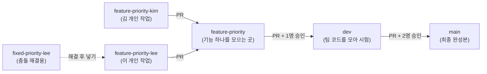
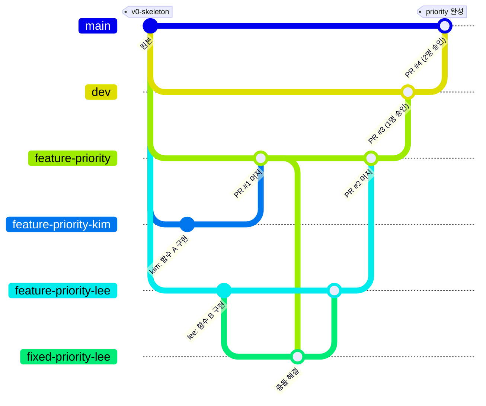
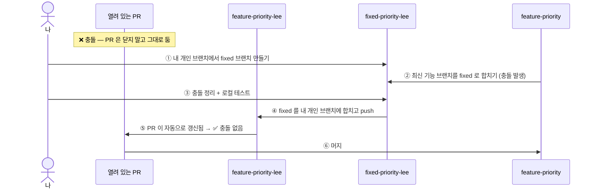

# 🌳 ThreeJ 팀 GitHub 전략

> 팀원 모두가 이 문서 하나만 보면 됩니다.
> 처음 보는 단어가 나오면 맨 아래 **[📖 용어 사전](#-용어-사전)** 을 먼저 보세요.

**목차**
[1. 한눈에 보기](#1-한눈에-보기) ·
[2. 브랜치 종류와 이름 규칙](#2-브랜치-종류와-이름-규칙) ·
[3. 전체 흐름 그림](#3-전체-흐름-그림) ·
[4. 단계별 작업 방법](#4-단계별-작업-방법) ·
[5. 충돌이 났을 때 (fixed 브랜치)](#5-충돌이-났을-때-fixed-브랜치) ·
[6. 승인 규칙](#6-승인-규칙) ·
[7. 브랜치를 지워도 기록이 남나요?](#7-브랜치를-지워도-기록이-남나요) ·
[8. 하지 말 것](#8-하지-말-것-) ·
[9. 처음 시작하는 팀원](#9-처음-시작하는-팀원) ·
[10. 구축 방법 (관리자)](#10-구축-방법-관리자) ·
[용어 사전](#-용어-사전)

---

## 1. 한눈에 보기



1. **기능 브랜치** `feature-기능명` 을 하나 만든다
2. 각자 거기서 **개인 브랜치** `feature-기능-이름` 을 따서 작업한다
3. 함수가 완성되면 **로컬에서 테스트** → 기능 브랜치로 **PR**
4. 충돌이 나면 PR 은 열어둔 채 **`fixed-` 브랜치**에서 해결 → 개인 브랜치에 넣기 → PR 머지
5. 기능이 다 모이면 **dev** 로 PR (1명 승인) → dev 에서 테스트
6. 최종으로 **main** 에 PR (2명 승인)

- 원본 Pintos 코드는 `v0-skeleton` **태그**로 영구 보관되어 있습니다.

---

## 2. 브랜치 종류와 이름 규칙

| 종류 | 이름 형식 | 예시 | 누가 | 보호 규칙 | 머지 후 |
|---|---|---|---|---|---|
| 최종본 | `main` | — | 팀 전체 | PR + **2명 승인**, 직접 push 금지 | 영구 보존 |
| 통합 | `dev` | — | 팀 전체 | PR + **1명 승인**, 직접 push 금지 | 영구 보존 |
| 기능 | `feature-<기능>` | `feature-priority` | 팀 전체 공유 | 없음 | dev 에 합쳐지면 **자동 삭제** |
| 개인 작업 | `feature-<기능>-<이름>` | `feature-priority-kim` | 본인 | 없음 | 기능 브랜치에 합쳐지면 **자동 삭제** |
| 충돌 해결 | `fixed-<기능>-<이름>` | `fixed-priority-lee` | 본인 | 없음 | 해결 후 직접 삭제 |

- 이름은 **영어 소문자 + 하이픈(`-`)** 만 사용 (한글 X)
- 개인 브랜치의 **마지막 단어 = 내 이름**. 기능 이름은 기능 브랜치와 똑같이.

---

## 3. 전체 흐름 그림



---

## 4. 단계별 작업 방법

### ① 기능 시작 — 기능 브랜치 만들기 (기능당 1번, 한 명만)

```bash
git fetch origin && git push origin origin/dev:refs/heads/feature-priority
```

### ② 내 개인 브랜치 만들기

```bash
git fetch origin && git switch -c feature-priority-kim origin/feature-priority
```

### ③ 작업하고 올리기 (매일 퇴근 전 push = 백업 + 진행 공유)

```bash
git add -p && git commit -m "feat: ready list 를 우선순위 순으로 정렬"
```
```bash
git push -u origin HEAD
```

### ④ 함수 완성 → 로컬 테스트 → 기능 브랜치로 PR

```bash
cd pintos/threads && make && cd build && make check
```
```bash
gh pr create --base feature-priority --fill
```
(GitHub 웹에서 **Compare & pull request** → base 를 `feature-priority` 로 골라도 됨)

> ⚠️ 기본 브랜치가 `main` 이라서 웹에서 PR 을 만들면 **base 가 `main` 으로 잡혀 있습니다.** 반드시 바꾸세요.

- 승인 없이 **본인이 바로 머지** 가능 → **Create a merge commit** 클릭
- 충돌 표시가 뜨면 → [5. 충돌이 났을 때](#5-충돌이-났을-때-fixed-브랜치)
- 머지되면 내 개인 브랜치는 자동 삭제됨. 다음 함수는 ② 부터 다시 (최신 기능 브랜치에서 새로 따기)

### ⑤ 기능 완성 → dev 로 PR (1명 승인)

먼저 **이 기능 브랜치로 열린 개인 PR 이 하나도 없는지** 확인:
```bash
gh pr list --base feature-priority
```
비어 있으면 PR 생성:
```bash
gh pr create --base dev --head feature-priority --fill
```
- 팀원 1명이 승인 → 머지 → `feature-priority` 자동 삭제
- 머지 후 dev 를 받아서 테스트:
  ```bash
  git fetch origin && git switch dev && git pull && cd pintos/threads && make && cd build && make check
  ```

### ⑥ 최종 → main 으로 PR (2명 승인)

```bash
gh pr create --base main --head dev --fill
```
- **나를 뺀 팀원 2명 모두** 승인 → 머지

---

## 5. 충돌이 났을 때 (fixed 브랜치)

**충돌(conflict)** = 내가 고친 줄을 다른 팀원도 고쳐서 먼저 머지한 상황.
PR 화면에 *"This branch has conflicts that must be resolved"* 가 뜹니다.



**① fixed 브랜치 만들기** (내 개인 브랜치에서)
```bash
git switch feature-priority-lee && git switch -c fixed-priority-lee
```

**② 최신 기능 브랜치 합치기** → 충돌 발생
```bash
git fetch origin && git merge origin/feature-priority
```

**③ 충돌 정리**
충돌난 파일을 열어 `<<<<<<<` ~ `=======` ~ `>>>>>>>` 사이를 올바른 코드로 고치고 표시 줄은 지웁니다.
VSCode 에서는 *Accept Current / Incoming / Both* 버튼으로 골라도 됩니다. 그다음 저장 →
```bash
git add . && git commit
```
로컬 테스트:
```bash
cd pintos/threads && make && cd build && make check
```

**④ 내 개인 브랜치에 넣고 push**
```bash
git switch feature-priority-lee && git merge fixed-priority-lee && git push
```

**⑤ PR 화면 새로고침** → 충돌 표시가 사라지고 머지 버튼 활성화 → 머지

**⑥ fixed 브랜치 정리**
```bash
git branch -d fixed-priority-lee
```

> 💡 **왜 바로 개인 브랜치에서 안 고치고 fixed 를 거치나요?**
> 충돌 정리를 잘못해도 내 개인 브랜치는 멀쩡하게 남아 있어서, fixed 만 지우고 다시 시도하면 됩니다.

---

## 6. 승인 규칙

| 합치는 방향 | 필요한 승인 | 누가 머지 |
|---|---|---|
| 개인 → 기능 (`feature-기능-이름` → `feature-기능`) | 없음 | 본인 |
| fixed → 개인 | 없음 (로컬에서 합침) | 본인 |
| 기능 → dev | **1명** | 승인 받은 뒤 작성자 |
| dev → main | **나를 뺀 2명** (= 나머지 팀원 전원) | 승인 받은 뒤 작성자 |

- GitHub 는 **PR 작성자 본인의 승인은 세지 않습니다.**
- 승인 뒤에 코드를 또 push 하면 **승인이 취소**되고 다시 받아야 합니다 (dev, main).
- 레포 관리자(picky232)는 **우회(bypass) 권한**으로 승인 없이 머지할 수 있습니다. 단, **main · dev 삭제는 관리자도 불가**합니다.
- 리뷰 부탁: PR 오른쪽 **Reviewers** 에서 지정 + 팀 채팅에 PR 링크 공유.
- **main 은 dev 에서만** PR 합니다. (시스템이 막지는 않으니 팀 약속으로 지키기)

---

## 7. 브랜치를 지워도 기록이 남나요?

**네. 머지된 브랜치는 지워도 커밋 기록이 그대로 남습니다.**

- 브랜치는 커밋을 가리키는 **이름표**일 뿐입니다. 머지하면 커밋들이 기능 브랜치 → dev → main 기록 안으로 들어가므로, 이름표를 떼도 커밋은 남습니다.
- merge commit 메시지에 **브랜치 이름이 영구히** 남습니다.
  예: `Merge pull request #12 from picky232/feature-priority-kim`
- **PR 페이지도 영구 보존**됩니다 (커밋 목록, 코멘트, 변경 내용). 필요하면 PR 화면의 **Restore branch** 로 브랜치를 되살릴 수 있습니다.
- 자동 삭제는 **머지된 PR 의 브랜치에만** 일어나므로 안전합니다.
- 단, **머지 안 한 브랜치를 직접 지우면** 그 커밋은 사라질 수 있으니 주의.

누가 무엇을 했는지 보기:
```bash
git log --oneline --graph --first-parent dev
```
```bash
git log --oneline --merges
```

---

## 8. 하지 말 것 🚫

| 하지 말 것 | 이유 |
|---|---|
| `main` / `dev` 에 직접 push | 막혀 있음. 반드시 PR |
| 개인 PR 이 열린 채로 기능 → dev 머지 | 기능 브랜치가 자동 삭제되면서 남은 PR 의 대상이 dev 로 바뀌어 버림 |
| `feature-*` → `main` 바로 PR | dev 에서 시험을 안 거친 코드가 최종본에 들어감 |
| 테스트 안 하고 PR | 자동 테스트가 없어서 내가 확인 안 하면 아무도 모름 |
| `printf` 디버그 출력 남기고 PR | Pintos 테스트는 출력 비교라서 FAIL 됨 |
| 남의 개인 브랜치에 push | 그 사람 작업과 꼬임 |
| 같은 함수를 말없이 동시에 수정 | 충돌 발생. 작업 전에 공유 |
| 충돌 났다고 PR 닫기 | fixed 로 해결하면 같은 PR 그대로 머지 가능 |
| PR 의 base 확인 안 하기 | 기본값이 `main` 이라 실수로 최종본에 올라갈 수 있음 |

---

## 9. 처음 시작하는 팀원

- [ ] 메일 또는 GitHub 알림으로 온 **레포 초대 수락**
- [ ] 레포 받기 — **폴더 이름을 꼭 `pintos_22.04_lab_docker` 로** (개발 컨테이너 설정이 이 이름을 씀)
  ```bash
  git clone https://github.com/picky232/ThreeJ-team-Pintos.git pintos_22.04_lab_docker
  ```
  clone 하면 `main`(최종본)이 열립니다. 작업 브랜치는 항상 `origin/dev` 나 `origin/feature-*` 에서 따세요.
- [ ] VSCode 로 폴더 열기 → 왼쪽 아래 `><` 버튼 → **Reopen in Container**
- [ ] 컨테이너 터미널에서 내 정보 설정
  ```bash
  git config --global user.name "내이름" && git config --global user.email "깃허브이메일"
  ```
- [ ] 팀원과 **누가 어떤 기능/함수를 맡을지** 나누기

---

## 10. 구축 방법 (관리자)

> 이 레포는 아래 설정이 **이미 모두 적용**되어 있습니다. 다음에 새 레포를 만들 때 참고하세요.
> 필요한 것: 레포 **관리자 권한**, 레포 **공개(Public)** 유지 (개인 무료 계정은 공개 레포에서만 보호 규칙 사용 가능)

| 단계 | 내용 | 상태 |
|---|---|---|
| ① | 원본 태그 + dev 만들기 | ✅ |
| ② | 레포 기본 설정 | ✅ |
| ③ | 보호 규칙 (main 2명 / dev 1명 + main·dev 삭제 금지) | ✅ |
| ④ | 팀원 초대 | ✅ |

### ① 원본 태그 + dev 만들기

```bash
git tag v0-skeleton a345ec1 && git push origin v0-skeleton
```
```bash
git switch -c dev && git push -u origin dev
```

### ② 레포 기본 설정 — Settings → General

| 위치 | 설정 | 이유 |
|---|---|---|
| Default branch | `main` | 레포 첫 화면에 최종본이 보임. 이슈·PR 템플릿도 main 에 있어야 적용됨 |
| Pull Requests | ✅ Allow merge commits | 세부 커밋 기록 보존 |
| Pull Requests | ⬜ Allow squash merging | 커밋이 하나로 뭉쳐져 기록이 사라짐 |
| Pull Requests | ⬜ Allow rebase merging | 기록이 다시 써짐 |
| Pull Requests | ✅ Automatically delete head branches | 머지된 브랜치 자동 정리 |

터미널로 한 번에:
```bash
gh api -X PATCH repos/picky232/ThreeJ-team-Pintos -F delete_branch_on_merge=true -F allow_squash_merge=false -F allow_rebase_merge=false -F allow_merge_commit=true -f default_branch=main
```

> 자동 삭제를 켜도 main · dev 는 ③ 의 `keep-main-dev`(우회 없는 삭제 금지) 덕분에 지워지지 않습니다.

### ③ 보호 규칙 — Settings → Rules → Rulesets → New branch ruleset

**세 개**를 만듭니다. 모두 Enforcement **Active**.

| 항목 | `protect-main` | `protect-dev` | `keep-main-dev` |
|---|---|---|---|
| Target → Include by pattern | `main` | `dev` | `main`, `dev` |
| Bypass list | **Repository admin** (Always allow) | **Repository admin** (Always allow) | **비움** ← 중요 |
| Restrict deletions (삭제 금지) | ✅ | ✅ | ✅ |
| Block force pushes (강제 push 금지) | ✅ | ✅ | — |
| Require a pull request before merging | ✅ | ✅ | — |
| └ Required approvals | **2** | **1** | — |
| └ Dismiss stale approvals when new commits are pushed | ✅ | ✅ | — |
| └ Allowed merge methods | Merge 만 | Merge 만 | — |

`feature-*`, `fixed-*` 에는 규칙을 만들지 않습니다 (자유롭게 push, 승인 없이 머지).

> ⚠️ **bypass(우회) 주의 — 왜 `keep-main-dev` 가 따로 있나요?**
> bypass 는 규칙 하나가 아니라 **그 규칙 묶음 전체**를 건너뜁니다.
> `protect-main` / `protect-dev` 에 관리자 우회를 넣으면 승인뿐 아니라 **삭제 금지도 관리자에게는 꺼집니다.**
> "머지 후 자동 삭제" 는 머지 버튼을 누른 사람 권한으로 실행되기 때문에, 관리자가 `dev → main` 을 머지하면 **dev 가 자동 삭제**됩니다 (실제로 발생했던 일).
> 그래서 삭제 금지만 담은 **우회 없는 규칙**(`keep-main-dev`)을 따로 둡니다.
> 관리자에게도 반드시 걸려야 하는 규칙은 항상 **우회 없는 별도 규칙**으로 만드세요.

<details>
<summary>터미널로 만들기 (gh)</summary>

`protect-dev` (관리자 우회 포함). `protect-main` 은 `dev` → `main`, `1` → `2` 로 바꿔서 한 번 더 실행.

```bash
gh api repos/picky232/ThreeJ-team-Pintos/rulesets --input - <<'EOF'
{
  "name": "protect-dev",
  "target": "branch",
  "enforcement": "active",
  "bypass_actors": [ { "actor_id": 5, "actor_type": "RepositoryRole", "bypass_mode": "always" } ],
  "conditions": { "ref_name": { "include": ["refs/heads/dev"], "exclude": [] } },
  "rules": [
    { "type": "deletion" },
    { "type": "non_fast_forward" },
    { "type": "pull_request", "parameters": {
        "required_approving_review_count": 1,
        "dismiss_stale_reviews_on_push": true,
        "require_code_owner_review": false,
        "require_last_push_approval": false,
        "required_review_thread_resolution": false,
        "allowed_merge_methods": ["merge"] } }
  ]
}
EOF
```

`keep-main-dev` (우회 없음):
```bash
gh api repos/picky232/ThreeJ-team-Pintos/rulesets --input - <<'EOF'
{
  "name": "keep-main-dev",
  "target": "branch",
  "enforcement": "active",
  "bypass_actors": [],
  "conditions": { "ref_name": { "include": ["refs/heads/main", "refs/heads/dev"], "exclude": [] } },
  "rules": [ { "type": "deletion" } ]
}
EOF
```

현재 규칙 확인 (규칙마다 따로 조회해야 bypass 개수가 정확히 나옴):
```bash
for id in $(gh api repos/picky232/ThreeJ-team-Pintos/rulesets --jq '.[].id'); do gh api repos/picky232/ThreeJ-team-Pintos/rulesets/$id --jq '"\(.name) \(.enforcement) bypass=\(.bypass_actors | length) \(.conditions.ref_name.include)"'; done
```
정상이면:
```
keep-main-dev active bypass=0 ["refs/heads/main","refs/heads/dev"]
protect-dev active bypass=1 ["refs/heads/dev"]
protect-main active bypass=1 ["refs/heads/main"]
```

삭제 금지 확인 — **거부되어야 정상** (`Bypassed` 문구 없이 `! [remote rejected]`):
```bash
git push origin --delete dev
```
</details>

### ④ 팀원 초대 — Settings → Collaborators → Add people

팀원 GitHub ID 입력 → 초대 → 팀원이 **수락해야** 승인 가능.

### 운영 팁

| 상황 | 할 일 |
|---|---|
| 규칙을 잠깐 꺼야 할 때 | Ruleset → Enforcement **Disabled** → 작업 → 다시 **Active** |
| 한 명이 장기 결석이라 main 머지가 막힐 때 | `protect-main` 승인 수를 잠깐 1 로 낮추고 팀에 공유 |
| 팀원이 바뀔 때 | ④ 에서 초대 / 제거 |

---

## 📖 용어 사전

| 용어 | 쉬운 설명 |
|---|---|
| **브랜치 (branch)** | 코드의 "평행 세계". 다른 사람 코드에 영향 없이 따로 작업하는 공간 |
| **커밋 (commit)** | 작업 내용을 저장하는 "세이브 포인트" |
| **push** | 내 컴퓨터의 커밋을 GitHub 에 올리기 |
| **fetch** | GitHub 의 최신 상태를 내 컴퓨터로 가져오기 (내 코드는 안 바뀜) |
| **pull** | fetch + 내 브랜치에 바로 합치기 |
| **PR (Pull Request)** | "내 브랜치를 저기에 합쳐 주세요" 라는 요청서. 리뷰와 승인이 여기서 이뤄짐 |
| **base / head** | PR 에서 base = 합쳐질 곳(받는 쪽), head = 내 브랜치(보내는 쪽) |
| **머지 (merge)** | 두 브랜치의 코드를 하나로 합치기 |
| **merge commit** | 합칠 때 "언제 무엇을 합쳤다" 는 기록을 남기는 방식. 세부 커밋도 모두 보존 |
| **squash / rebase** | 커밋을 뭉치거나 다시 쌓는 합치기 방식. 기록이 바뀌어서 **우리 팀은 안 씀** |
| **충돌 (conflict)** | 두 사람이 같은 줄을 다르게 고쳐서 Git 이 자동으로 못 합치는 상황 |
| **리뷰 / 승인 (approve)** | 다른 팀원이 코드를 보고 "합쳐도 된다" 고 확인해 주는 것 |
| **보호 규칙 (Ruleset)** | 브랜치별 규칙. 직접 push 금지, 승인 필요, 삭제 금지 등 |
| **Enforcement** | 규칙을 켤지(Active) 끌지(Disabled) 정하는 스위치 |
| **Bypass list** | 규칙을 무시해도 되는 사람 목록. 비워두면 예외 없음 |
| **force push (강제 push)** | GitHub 기록을 내 것으로 덮어쓰기. 기록이 사라질 수 있어 main · dev 는 금지 |
| **태그 (tag)** | 특정 커밋에 붙이는 영구 이름표. `v0-skeleton` = 원본 코드 |
| **Default branch** | 레포를 열거나 PR 을 만들 때 기본으로 선택되는 브랜치 |
| **Collaborator** | 레포에 쓰기 권한이 있는 사람 |
| **gh (GitHub CLI)** | GitHub 를 터미널에서 다루는 공식 도구 (`gh auth login` 으로 로그인) |
| **make check** | Pintos 공식 테스트 전체를 실행하는 명령 |
| **PASS / FAIL** | Pintos 테스트 통과 / 실패 |
