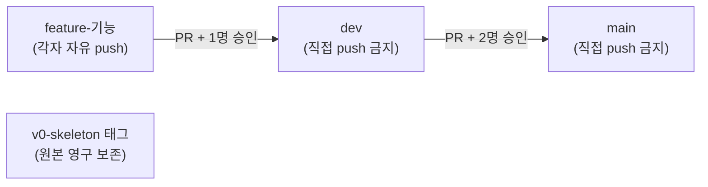

# 🛠 브랜치 전략 구축 가이드 (관리자용)

> 이 레포에 팀 브랜치 규칙과 보호 규칙을 **처음부터 만드는 방법**을 정리한 문서입니다.
> 팀원은 이 문서 대신 **[TEAM_GUIDE.md](TEAM_GUIDE.md)** 만 읽으면 됩니다.
> 모르는 단어는 맨 아래 **[📖 용어 설명](#-용어-설명)** 을 보세요.

---

## 0. 최종 결과물



| 항목 | 설정 |
|---|---|
| 브랜치 | `main`, `dev`, `feature-*` 3종류 |
| main | dev 에서 PR + 작성자 제외 **2명 승인**, 직접 push·삭제·강제 push 금지 |
| dev | feature 에서 PR + **1명 승인**, 직접 push·삭제·강제 push 금지 |
| feature-* | 규칙 없음 (자유 push). dev 에 합쳐지면 자동 삭제 |
| 합치기 방식 | merge commit 만 허용 → 세부 커밋 기록 보존 |
| 관리자 예외 | 없음 (레포 주인도 똑같이 PR + 승인) |
| 자동 테스트(CI) | 없음 — 각자 `make check` 후 PR 양식에 결과 기록 |

### 진행 상황

| 단계 | 상태 |
|---|---|
| ① 원본 태그 + dev 만들기 | ✅ |
| ② 레포 기본 설정 | ✅ |
| ③ 보호 규칙(Ruleset) | ✅ main · dev |
| ④ 팀원 초대 | ✅ Jongeume, jaeyun-sw-ai |
| ⑤ PR 양식 + 문서 | ✅ |
| ⑥ 혼자 시나리오 테스트 | ⏳ |

---

## 1. 준비물

| 항목 | 설명 |
|---|---|
| 레포 **관리자(admin)** 권한 | 설정·보호 규칙을 바꾸려면 필요 (레포 주인 = picky232) |
| 레포 **공개(Public)** 유지 | 개인 계정 무료 플랜은 **공개 레포에서만** 보호 규칙을 쓸 수 있음. 비공개로 바꾸면 규칙이 꺼짐 |
| `gh` (GitHub CLI) | 터미널에서 GitHub 설정을 바꾸는 도구. 웹 화면으로 해도 됨. `gh auth login` 으로 로그인 |

---

## 2. 순서대로 만들기

> ⚠️ **순서가 중요합니다.** 보호 규칙(③)을 먼저 걸면 dev 에 초기 파일을 push 할 수 없습니다.

### ① 원본 태그 + dev 만들기 (터미널)

```bash
git tag v0-skeleton a345ec1 && git push origin v0-skeleton
```
```bash
git switch -c dev && git push -u origin dev
```

- 원본 코드는 `v0-skeleton` **태그**로 영구 보존 → `main` 은 "완성본" 용도로 씁니다.

### ② 레포 기본 설정 (웹)

**Settings → General**

| 위치 | 설정 | 이유 |
|---|---|---|
| Default branch | `dev` | PR 을 만들 때 기본으로 dev 를 향하게 |
| Pull Requests | ✅ Allow merge commits | 세부 커밋 기록 보존 |
| Pull Requests | ⬜ Allow squash merging | 커밋이 하나로 뭉쳐져 기록이 사라짐 |
| Pull Requests | ⬜ Allow rebase merging | 기록이 다시 써짐 |
| Pull Requests | ✅ Automatically delete head branches | 합쳐진 feature 브랜치 자동 정리 |

> 자동 삭제를 켜도 **삭제 금지 규칙이 걸린 main·dev 는 지워지지 않습니다.**

같은 설정을 터미널로:
```bash
gh api -X PATCH repos/picky232/ThreeJ-team-Pintos -F delete_branch_on_merge=true -F allow_squash_merge=false -F allow_rebase_merge=false -F allow_merge_commit=true -f default_branch=dev
```

### ③ 보호 규칙 (Ruleset) — 웹

**Settings → Rules → Rulesets → New ruleset → New branch ruleset**

두 개를 만듭니다. 공통 설정:
- Enforcement status: **Active**
- Bypass list: **비워둠** (관리자도 예외 없음)

| 항목 | `protect-main` | `protect-dev` |
|---|---|---|
| Target branches → Add target → Include by pattern | `main` | `dev` |
| ✅ Restrict deletions (삭제 금지) | ✅ | ✅ |
| ✅ Block force pushes (강제 push 금지) | ✅ | ✅ |
| ✅ Require a pull request before merging | ✅ | ✅ |
| └ Required approvals (필요 승인 수) | **2** | **1** |
| └ Dismiss stale pull request approvals when new commits are pushed | ✅ | ✅ |
| └ Allowed merge methods | Merge 만 | Merge 만 |

> **승인 2명 = 작성자 빼고 2명.** GitHub 는 PR 작성자 본인의 승인을 세지 않습니다.
> 3인 팀이면 "나머지 두 명 모두 승인" 이라는 뜻이고, 한 명이 결석하면 main 머지가 멈춥니다.

<details>
<summary>터미널로 한 번에 만들기 (gh)</summary>

`protect-dev` 예시 (`protect-main` 은 `dev` → `main`, 승인 수 `1` → `2` 로 바꿔서 한 번 더 실행):

```bash
gh api repos/picky232/ThreeJ-team-Pintos/rulesets --input - <<'EOF'
{
  "name": "protect-dev",
  "target": "branch",
  "enforcement": "active",
  "bypass_actors": [],
  "conditions": { "ref_name": { "include": ["refs/heads/dev"], "exclude": [] } },
  "rules": [
    { "type": "deletion" },
    { "type": "non_fast_forward" },
    { "type": "pull_request", "parameters": {
        "required_approving_review_count": 1,
        "dismiss_stale_reviews_on_push": true,
        "require_code_owner_review": false,
        "require_last_push_approval": false,
        "required_review_thread_resolution": false,
        "allowed_merge_methods": ["merge"] } }
  ]
}
EOF
```
</details>

### ④ 팀원 초대 (웹)

**Settings → Collaborators → Add people** → 팀원 GitHub ID 입력 → 초대.
팀원이 메일/알림에서 **수락해야** PR 승인이 가능합니다.

```bash
gh api repos/picky232/ThreeJ-team-Pintos/collaborators --jq '.[].login'
```

### ⑤ PR 양식 + 문서

| 파일 | 역할 |
|---|---|
| `.github/pull_request_template.md` | PR 을 열면 자동으로 채워지는 양식 (구현 내용 / 이유 / `make check` 결과) |
| `docs/TEAM_GUIDE.md` | 팀원용 작업 가이드 |
| `docs/SETUP_GUIDE.md` | 이 문서 |

### ⑥ 혼자 시나리오 테스트

| 해보기 | 기대 결과 |
|---|---|
| dev 에서 `feature-demo` 만들어 커밋 push | ✅ 허용 |
| `dev` 에 직접 `git push` | ❌ 거부 (`Changes must be made through a pull request`) |
| `feature-demo` → `dev` PR 을 내가 열고 내가 머지 시도 | ❌ 승인 1명 필요 (팀원 승인 받으면 ✅) |
| 팀원 승인 후 머지 | ✅ 합쳐지고 `feature-demo` 자동 삭제, dev 는 남음 |

테스트 후 남은 PR·브랜치는 정리합니다.

---

## 3. 운영하면서 할 일

| 상황 | 할 일 |
|---|---|
| 규칙을 잠깐 꺼야 할 때 (초기 파일 올리기 등) | Ruleset → Enforcement **Disabled** → 작업 → 다시 **Active**. 끄고 켠 기록이 남습니다 |
| 팀원이 바뀔 때 | ④ 에서 초대 / 제거. 승인 수는 그대로 |
| 한 명이 장기 결석이라 main 머지가 막힐 때 | `protect-main` 승인 수를 잠깐 1 로 낮추고 팀에 공유 |
| 다음 주 새 레포에 같은 규칙을 만들 때 | 이 문서 ①~⑤ 를 그대로 반복 (레포 이름만 바꿔서) |
| 보호 규칙 현재 상태 확인 | `gh api repos/picky232/ThreeJ-team-Pintos/rulesets` |

---

## 📖 용어 설명

| 용어 | 쉬운 설명 |
|---|---|
| **브랜치 (branch)** | 코드의 "평행 세계". 따로 작업하는 공간 |
| **태그 (tag)** | 특정 커밋에 붙이는 영구 이름표 |
| **PR (Pull Request)** | "내 브랜치를 저기에 합쳐 주세요" 라는 요청서 |
| **승인 (approve)** | 다른 팀원이 "합쳐도 된다" 고 확인해 주는 것 |
| **Ruleset (보호 규칙)** | 브랜치별 규칙 묶음. 직접 push 금지, 승인 필요, 삭제 금지 등 |
| **Enforcement** | 규칙을 켤지(Active) 끌지(Disabled) 정하는 스위치 |
| **Bypass list** | 규칙을 무시해도 되는 사람 목록. 비워두면 예외 없음 |
| **force push (강제 push)** | GitHub 의 기록을 내 것으로 덮어쓰기. 기록이 사라질 수 있어 main·dev 는 금지 |
| **merge commit** | 합칠 때 "언제 무엇을 합쳤다" 는 기록을 남기는 방식. 세부 커밋도 보존 |
| **squash / rebase** | 커밋을 뭉치거나 다시 쌓는 합치기 방식. 기록이 바뀌어서 꺼둠 |
| **Default branch** | 레포를 열거나 PR 을 만들 때 기본으로 선택되는 브랜치 |
| **Collaborator** | 레포에 쓰기 권한이 있는 사람 |
| **gh (GitHub CLI)** | GitHub 를 터미널에서 다루는 공식 도구 |
| **CI** | PR 이 오면 자동으로 빌드·테스트해 주는 기능. 우리 팀은 쓰지 않고 각자 `make check` 로 대신함 |
