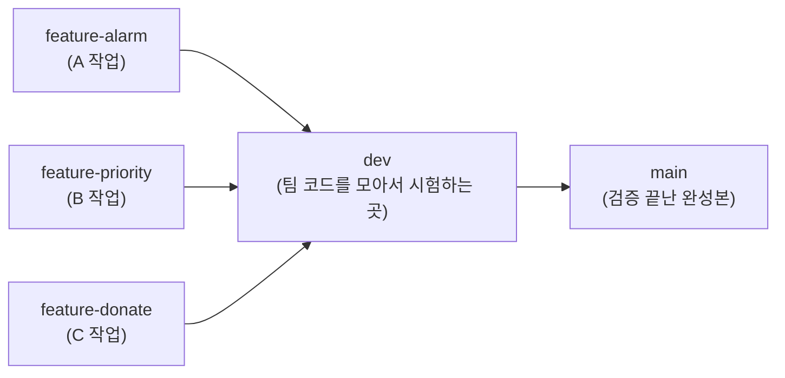
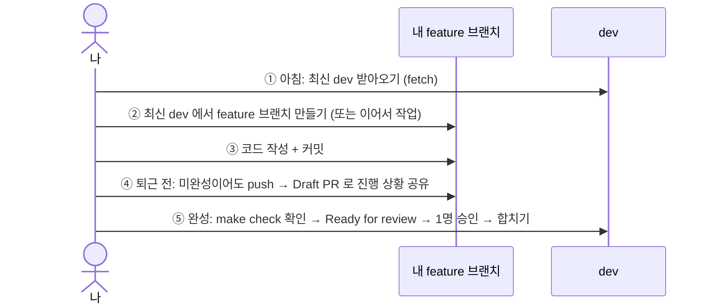
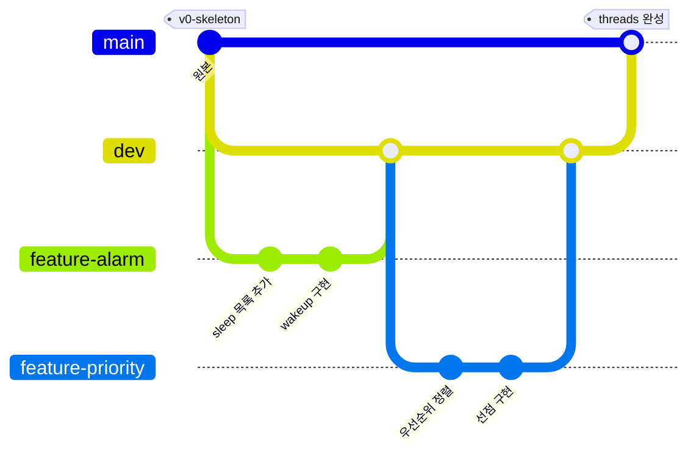

# 🌳 ThreeJ 팀 작업 가이드 (팀원용)

> 이 문서만 읽으면 팀 규칙대로 작업할 수 있습니다.
> 처음 보는 단어가 나오면 맨 아래 **[📖 용어 사전](#-용어-사전)** 을 먼저 보세요.

**목차**
[0. 첫날 할 일](#0-첫날-할-일-) ·
[1. 한눈에 보기](#1-한눈에-보기) ·
[2. 브랜치별 역할](#2-브랜치별-역할) ·
[3. 하루 작업 순서](#3-하루-작업-순서) ·
[4. 기능 하나가 완성되는 모습](#4-기능-하나가-완성되는-모습) ·
[5. 합치기(PR) 규칙](#5-합치기pr-규칙) ·
[6. 명령어 모음](#6-명령어-모음) ·
[7. 이럴 땐 이렇게](#7-이럴-땐-이렇게-) ·
[8. 하지 말 것](#8-하지-말-것-)

---

## 0. 첫날 할 일 ✅

- [ ] 메일 또는 GitHub 알림으로 온 **레포 초대 수락**
- [ ] 레포 받기 — **폴더 이름을 꼭 `pintos_22.04_lab_docker` 로** (개발 컨테이너 설정이 이 이름을 씁니다)
  ```bash
  git clone https://github.com/picky232/ThreeJ-team-Pintos.git pintos_22.04_lab_docker
  ```
- [ ] VSCode 로 폴더 열기 → 왼쪽 아래 `><` 버튼 → **Reopen in Container**
- [ ] 컨테이너 터미널에서 내 이름 설정
  ```bash
  git config --global user.name "내이름" && git config --global user.email "깃허브이메일"
  ```
- [ ] 이 문서 끝까지 읽기 → 팀원과 **누가 어떤 기능을 맡을지** 나누기

---

## 1. 한눈에 보기

브랜치는 딱 **3종류**입니다. 코드는 **feature → dev → main** 한 방향으로만 흐릅니다.



- 화살표 = **PR(합쳐 달라는 요청)** 방향.
- `main` 과 `dev` 는 **직접 push 불가**. 반드시 PR 로만 합칩니다.
- 원본 Pintos 코드는 `v0-skeleton` **태그**로 영구 보관되어 있습니다.

---

## 2. 브랜치별 역할

| 브랜치 | 누가 | 언제 쓰나 | 합치려면 | 합친 뒤 |
|---|---|---|---|---|
| `main` | 팀 전체 | 검증 끝난 완성본 | `dev` 에서 PR + **나 빼고 2명 승인** | 영구 보존 |
| `dev` | 팀 전체 | 모든 기능을 모아서 시험 | `feature-*` 에서 PR + **1명 승인** | 영구 보존 |
| `feature-기능` | 각자 | 실제 코드 작성 (자유롭게 push) | — | dev 에 합쳐지면 **자동 삭제** |

**이름 짓는 법** — 영어 소문자 + 하이픈(`-`) 만 사용

| 형식 | 예시 |
|---|---|
| `feature-<기능>` | `feature-alarm`, `feature-priority` |
| `feature-<기능>-<세부>` (기능을 더 잘게 나눌 때) | `feature-priority-donate-one` |

> 💡 feature 브랜치 이름이 곧 **작업 기록**입니다. PR 이 합쳐지고 브랜치가 지워져도
> `git log` 에 "Merge pull request #12 from .../feature-priority-donate-one" 처럼 남습니다.

---

## 3. 하루 작업 순서



- **매일 퇴근 전 push** 하면 그게 백업이자 진행 상황 공유입니다.
- **Draft PR** 을 열어두면 팀원이 내 진행 상황을 한 화면에서 볼 수 있습니다.

---

## 4. 기능 하나가 완성되는 모습



- 합칠 때 **merge commit** 을 남기므로, 브랜치가 지워져도 세부 커밋이 `git log` 에 그대로 남습니다.
- 다른 사람 기능에 의존하는 작업은 **그 기능이 dev 에 합쳐진 뒤** 최신 dev 에서 시작합니다.

---

## 5. 합치기(PR) 규칙

| 합치는 방향 | 필요한 승인 | 합치기 전 할 일 |
|---|---|---|
| feature → dev | 1명 | 내 컴퓨터에서 `make check` 돌려서 결과를 PR 에 적기 |
| dev → main | **나 빼고 2명** (= 나머지 팀원 전원) | dev 에서 `make check` 결과 확인 |

- 자동 테스트(CI)가 없으므로 **테스트는 각자 직접** 돌리고 PR 양식에 결과를 적습니다.
  리뷰어는 "원래 PASS 이던 테스트가 FAIL 로 바뀌지 않았는지" 를 꼭 봅니다.
- **main 은 dev 에서만** PR 합니다. (시스템이 막지는 않으니 팀 약속으로 지키기)
- 승인 뒤에 코드를 또 push 하면 **승인이 취소**되고 다시 받아야 합니다.
- 합치기 버튼은 **Create a merge commit** 하나만 있습니다 (squash/rebase 는 꺼둠).
- 리뷰 부탁은 PR 오른쪽 **Reviewers** 에서 지정 + 팀 채팅에 PR 링크 공유.

---

## 6. 명령어 모음

**최신 dev 에서 내 feature 브랜치 만들기**
```bash
git fetch origin && git switch -c feature-priority origin/dev
```

**작업 저장하고 올리기**
```bash
git add -p && git commit -m "feat: 우선순위 순으로 ready list 정렬" && git push -u origin HEAD
```

**Draft PR 만들기** (GitHub 웹에서 *Create draft pull request* 를 눌러도 됨)
```bash
gh pr create --draft --base dev --fill
```

**테스트 전체 돌리기** (컨테이너 터미널)
```bash
cd pintos/threads && make && cd build && make check
```

**테스트 하나만 돌리기**
```bash
cd pintos/threads/build && make tests/threads/priority-change.result
```

---

## 7. 이럴 땐 이렇게 💡

<details>
<summary><b>다른 사람 기능이 dev 에 합쳐졌어요 — 내 브랜치에도 받고 싶어요</b></summary>

```bash
git fetch origin && git merge origin/dev
```
</details>

<details>
<summary><b>충돌(conflict) 났어요</b></summary>

충돌난 파일을 열어 `<<<<<<<` ~ `>>>>>>>` 부분을 정리 → 저장 →
```bash
git add . && git commit && git push
```
어려우면 같은 함수를 고친 팀원과 같이 보세요.
</details>

<details>
<summary><b>main / dev 에 push 했는데 거부됐어요</b></summary>

정상입니다. 보호된 브랜치라서 PR 로만 합칠 수 있습니다.
지금 커밋을 feature 브랜치로 옮겨서 push 하세요:
```bash
git switch -c feature-올바른-이름 && git push -u origin HEAD
```
</details>

<details>
<summary><b>원래 되던 테스트가 FAIL 이 됐어요</b></summary>

1. 남겨둔 `printf` 가 없는지 먼저 확인 (출력 비교라서 printf 하나로도 FAIL)
2. 그 테스트만 다시 돌려보기: `make tests/threads/<테스트이름>.result`
3. priority·mlfqs 테스트는 타이밍에 민감해서 가끔 흔들립니다. 한 번 더 돌려서 또 FAIL 이면 진짜 문제.
</details>

<details>
<summary><b>원본 Pintos 코드를 보고 싶어요</b></summary>

```bash
git switch --detach v0-skeleton
```
다 보고 나면 `git switch -` 로 돌아오기.
</details>

---

## 8. 하지 말 것 🚫

| 하지 말 것 | 이유 |
|---|---|
| `main` / `dev` 에 직접 push | 막혀 있음. 반드시 PR |
| `feature` → `main` 바로 PR | dev 에서 시험을 안 거친 코드가 완성본에 들어감 |
| `make check` 안 돌리고 PR | 자동 테스트가 없어서 내가 확인 안 하면 아무도 모름 |
| `printf` 디버그 출력 남기고 PR | 공식 테스트는 출력 비교라서 FAIL 됨 |
| 같은 함수를 말없이 동시에 수정 | 충돌(conflict) 발생. 작업 전에 공유 |
| 한글 브랜치 이름 | 터미널에서 깨질 수 있음 |
| 다른 사람 feature 브랜치에 말없이 push | 그 사람 작업과 꼬임 |

---

## 📖 용어 사전

| 용어 | 쉬운 설명 |
|---|---|
| **브랜치 (branch)** | 코드의 "평행 세계". 다른 사람 코드에 영향 없이 따로 작업하는 공간 |
| **커밋 (commit)** | 작업 내용을 저장하는 "세이브 포인트" |
| **push** | 내 컴퓨터의 커밋을 GitHub 에 올리기 |
| **fetch** | GitHub 의 최신 상태를 내 컴퓨터로 가져오기 (내 코드는 안 바뀜) |
| **PR (Pull Request)** | "내 브랜치를 저기에 합쳐 주세요" 라는 요청서. 코드 리뷰와 승인이 여기서 이뤄짐 |
| **base / head** | PR 에서 base = 합쳐질 곳(받는 쪽), head = 내 브랜치(보내는 쪽) |
| **Draft PR** | 아직 미완성인 PR. 합치기 버튼이 잠겨 있고, 진행 상황 공유용 |
| **머지 (merge)** | 두 브랜치의 코드를 하나로 합치기 |
| **merge commit** | 합칠 때 "언제 무엇을 합쳤다" 는 기록을 남기는 방식. 세부 커밋도 모두 보존됨 |
| **squash / rebase** | 커밋을 뭉치거나 다시 쌓는 합치기 방식. 기록이 바뀌어서 **우리 팀은 안 씀** |
| **리뷰 / 승인 (approve)** | 다른 팀원이 코드를 보고 "합쳐도 된다" 고 확인해 주는 것 |
| **보호 규칙 (Ruleset)** | 브랜치별 규칙. "직접 push 금지", "승인 필요", "삭제 금지" 등 |
| **태그 (tag)** | 특정 커밋에 붙이는 영구 이름표. `v0-skeleton` = 원본 코드 |
| **충돌 (conflict)** | 두 사람이 같은 줄을 다르게 고쳐서 Git 이 자동으로 못 합치는 상황 |
| **PASS / FAIL** | Pintos 공식 테스트 통과 / 실패 |
| **make check** | Pintos 공식 테스트 전체를 실행하는 명령 |

---

> 규칙을 바꾸거나 처음부터 세팅하는 방법은 관리자용 문서 **[SETUP_GUIDE.md](SETUP_GUIDE.md)** 를 보세요.
